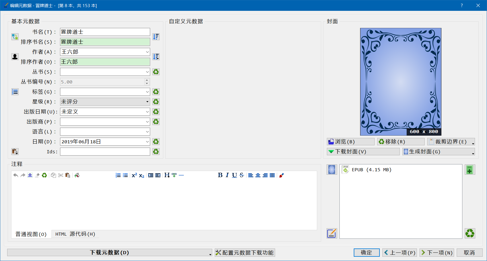
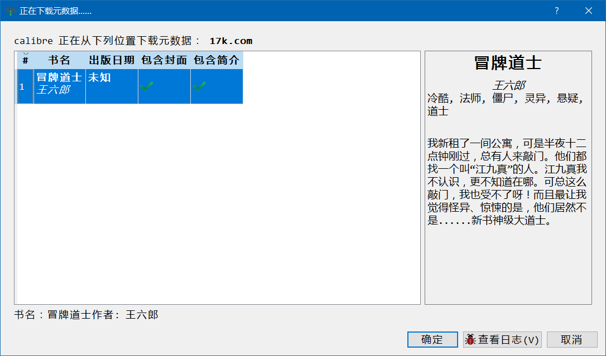
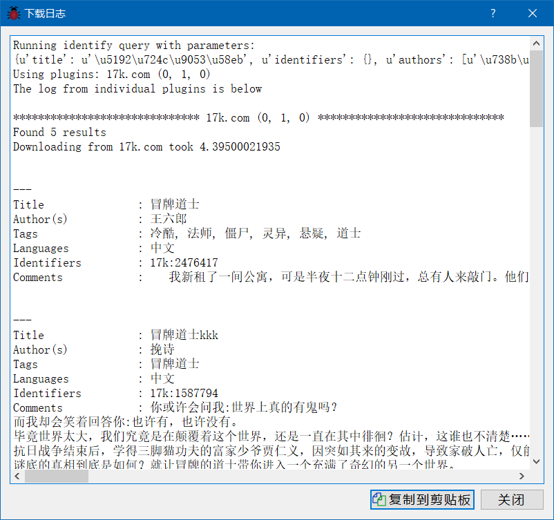
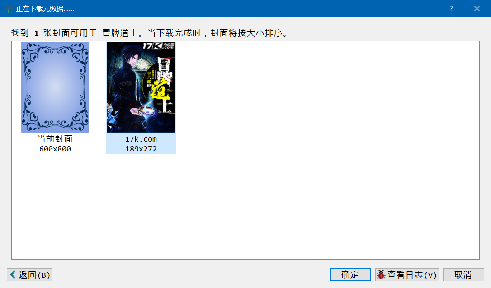
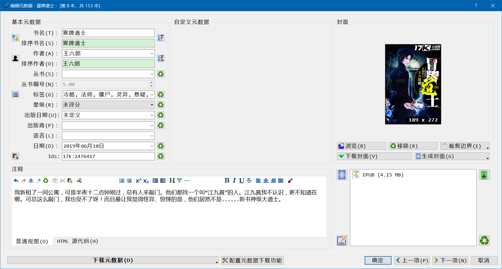

Calibre Metadata Source Plugin for 17K
=========

### Author

Yohann Che \<cheyong007@live.com\>

### Introduction

This plugin allows Calibre to read book information from 17k.com when you choose to download/fetch metadata. 

> :warning:**Be CAUTION**
> All the books in 17k.com are **online** fiction books only, which are **without isbn**, and writtern in **Chinese** only.
>
> **NO ISBN.**
>
> **NO Publisher.**
>
> **NO Pub Date.**
> 
> *The search of 17k.com itself is not **accurate**, and the results are many other books.* 

Calibre currently comes with plugins for a number of information sources such as Amazon and Googlebooks. 
Adding this plugin can potentially increase both the success rate and quality of information retrieved for some of your Chinese books.

This plugin is a modified version from "Amazon_CN" which is written by Grant Drake <grant.drake@gmail.com> and Bruce Chou <brucechou24@gmail.com>.

### Main Features

This plugin can retrieve the following items below from 17k.com.

- cover
- title
- authors
- tag
- comments
- book_id(asin) 

#### Not Working metadata
- series
- book_url
- languages

### Special Notes:
* Requires Calibre 0.8 or later.

### Installation Notes:

Download the zip file and install the plugin as described in the Introduction to plugins thread.
Note that this is not a GUI plugin so it is not intended/cannot be added to context menus/toolbars etc.

## Known Issues
- Results are not accurate, may get results of other books.
- Cannot set the `series`, `languages`.
- The plugin is in english, not chinese yet.

### Version History:

* __Version 0.1.0__ - 23 Aug 2019  
    Initial release of plugin.

### Screenshots

Start download metadata:

Get metadata result:

Check metadata log:

Download cover picture:

Set the metadata:

