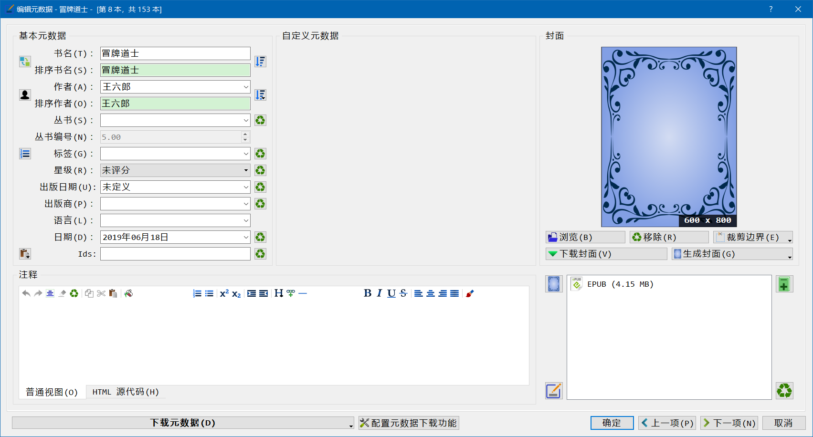
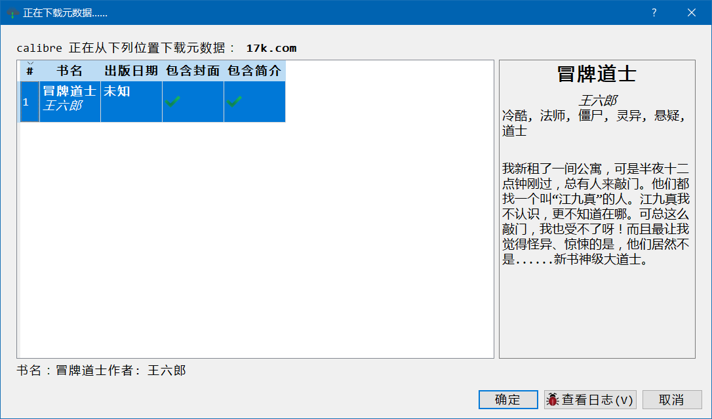

17k.com元数据下载插件
=========

### 作者

车勇 \<cheyong007@live.com\>

### Introduction

从17k.com网站获取**网络小说**的元数据信息。
扩展Calibre无法搜索无ISBN非出版书籍的功能。

> :warning:**注意**
> 17k.com上的所有书籍均为**中文在线网络**小说，**非纸质出版物书籍**，只有简体中文。
>
> **无 ISBN！**
>
> **无出版商！**
>
> **无出版日期！**
> 
> *17k.com本身的搜索结果准确度不高，可能结果并非是所搜书籍的信息。*
> **请谨慎使用。**

本插件由Grant Drake <grant.drake@gmail.com> and Bruce Chou <brucechou24@gmail.com>编写的 "Amazon_CN"插件改编而来。 

### 主要功能

本插件从17k.com以书名为关键字来进行搜索，获取以下元数据：

- 封面
- 书名
- 作者
- 标签
- 注释（简介）
- 书号（Ids）

#### 不支持的元数据
- ISBN
- 出版商
- 出版日期
- 星级（评分）

### 版本需求
* Calibre 0.8 及更高版本.

### 安装方式

下载zip文件；
打开Calibre，点击`首选项`，`高级选项`，`插件`；
点击`从文件加载插件`，打开插件zip文件；
点击`是`，确认风险提示，安装插件；
点击`确定`完成安装。

> :warning 
> 本插件非图形界面插件，无法加入菜单和工具栏。

### 插件设置
- 打开Calibre后进入`首选项`，`元数据下载`；
- 左侧`数据源`，勾选 `17k.com`，设置`封面优先级`；
- 选中`17k.com`，点击`配置所选源数据`；
- 取消 `出版商`，`出版日期`，`评分`，`语言`，点击`保存`；
- 点击`应用`
- 关闭`首选项`。

### 插件使用
对于书籍，点击`编辑元数据`，点击`下载元数据`，即可获得元数据。
:warning
如果结果与原书不符，请勿点击`确定`。

### 已知问题
- 无法设置`丛书系列（series）`和`语言(languages)`。
- 插件内输出日志信息仍为英文，未翻译为中文。
- 搜索返回结果不准确，没有经过对比验证。

### 版本历史

* __Version 0.1.0__ - 23 Aug 2019  
    初始发布。

### 截图

开始下载元数据：

获取元数据结果：

检查元数据日志：

下载封面图片：

更新元数据信息

